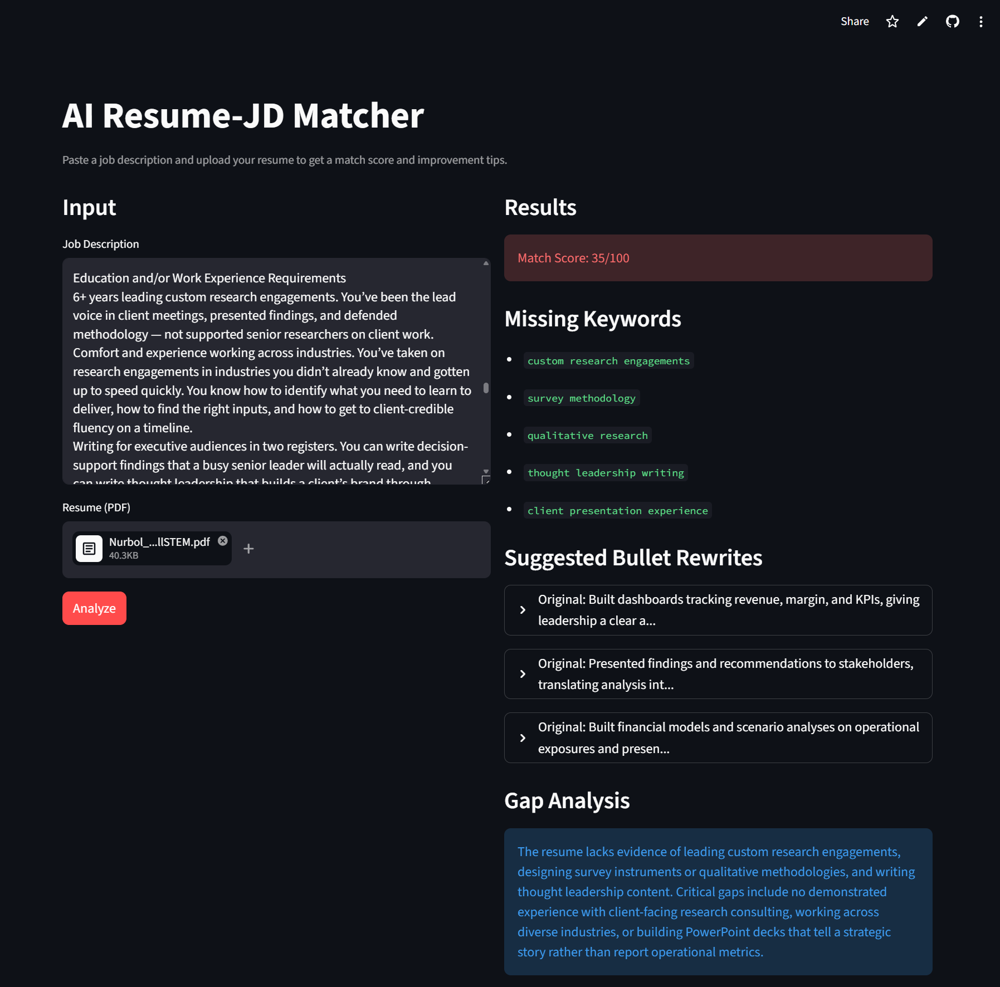

# AI Resume-JD Matcher

> 🚀 **Live Demo:** [resume-matcher-nurbolsultanov.streamlit.app](https://resume-matcher-nurbolsultanov.streamlit.app/)

A Streamlit web app that analyzes how well your resume matches a job description using Claude AI and semantic search.



---

## Why I Built This

Tailoring a resume to each job description is time-consuming and easy to do badly. I wanted a quick objective check before submitting — does my resume actually mirror the language of the JD, or am I just hoping it does?

This tool takes a resume PDF and a job description, retrieves the most relevant resume bullets via semantic search, and asks Claude to score the fit, surface missing keywords, and suggest concrete rewrites.

I use it on my own applications.

## What It Does

- **Match Score (0-100)** — how well your resume fits the JD
- **Missing Keywords** — top 5 terms in JD not found in your resume
- **Bullet Rewrites** — 3 suggested improvements tailored to the JD
- **Gap Analysis** — short summary of what's missing

## Example Workflow

1. Paste a job description into the left panel
2. Upload your resume PDF
3. Click **Analyze**
4. Review the match score, missing keywords, suggested rewrites, and gap analysis on the right

The full analysis takes ~10-15 seconds.

## How It Works

```
┌──────────────┐     ┌──────────────┐     ┌──────────────────┐
│  Streamlit   │ ──> │  pdfplumber  │ ──> │  Resume bullets  │
│      UI      │     │  PDF parser  │     │   (text chunks)  │
└──────────────┘     └──────────────┘     └────────┬─────────┘
                                                    │
                            ┌───────────────────────┴────────┐
                            │                                │
                            ▼                                ▼
                   ┌────────────────────┐         ┌─────────────────┐
                   │ sentence-          │         │   JD keywords   │
                   │ transformers       │         │   extraction    │
                   │ (MiniLM-L6-v2)     │         └────────┬────────┘
                   │ embeddings + RAG   │                  │
                   └─────────┬──────────┘                  │
                             │                             │
                             └──────────────┬──────────────┘
                                            ▼
                              ┌──────────────────────────┐
                              │  Anthropic Claude API    │
                              │  (analysis + rewrites)   │
                              └─────────────┬────────────┘
                                            │
                                            ▼
                              ┌──────────────────────────┐
                              │  Match score · keywords  │
                              │  rewrites · gap analysis │
                              └──────────────────────────┘
```

## Tech Stack

- **Python 3.11+**
- **[Streamlit](https://streamlit.io)** — UI
- **[Anthropic Claude](https://anthropic.com)** — AI analysis
- **[sentence-transformers](https://www.sbert.net)** — semantic retrieval (`all-MiniLM-L6-v2`)
- **[pdfplumber](https://github.com/jsvine/pdfplumber)** — PDF parsing
- **[pytest](https://pytest.org)** — testing

## Setup

### 1. Clone the repo

```bash
git clone https://github.com/nurbolsultanov/resume-matcher.git
cd resume-matcher
```

### 2. Create virtual environment

```bash
python -m venv venv

# Windows
venv\Scripts\activate

# Mac/Linux
source venv/bin/activate
```

### 3. Install dependencies

```bash
pip install -r requirements.txt
```

### 4. Add your API key

Create a `.env` file in the project root:

```env
ANTHROPIC_API_KEY=sk-ant-...
```

Get a key at [console.anthropic.com](https://console.anthropic.com/).

### 5. Run

```bash
streamlit run app.py
```

Open [http://localhost:8501](http://localhost:8501).

## Run Tests

```bash
pytest tests/ -v
```

## Deploy on Streamlit Cloud

1. Push the repo to GitHub
2. Go to [share.streamlit.io](https://share.streamlit.io)
3. Connect the repo, set main file as `app.py`
4. Add `ANTHROPIC_API_KEY` in **Settings → Secrets**

## Project Structure

```
resume-matcher/
├── app.py              # Streamlit UI
├── matcher.py          # Core matching logic + Claude API
├── pdf_parser.py       # PDF text extraction
├── prompts.py          # Claude prompts
├── requirements.txt
├── .env                # API key (gitignored)
├── .gitignore
├── README.md
├── docs/
│   └── screenshot.png  # Demo screenshot
└── tests/
    └── test_matcher.py
```

## Limitations

This is a v1 — honest about what it does and doesn't do:

- **Match score is heuristic, not absolute.** It compares language overlap and semantic similarity, not whether you'd actually get the job. A high score means the resume mirrors the JD well, not that the JD is a good fit for you.
- **PDF parsing isn't perfect for multi-column layouts.** Highly formatted resumes (heavy tables, two-column designs) can lose ordering. Plain single-column PDFs work best.
- **Claude API costs.** Each analysis uses ~2-3K tokens. Roughly \$0.01-0.02 per analysis at current Sonnet pricing.
- **English only.** Embeddings and prompts are tuned for English content.

## Future Work

- Support multiple PDF formats (DOCX, plain text)
- Customizable scoring rubrics (e.g. weight technical skills higher for IC roles, communication higher for client-facing roles)
- Multi-language support
- Side-by-side comparison of multiple JDs against one resume
- Batch processing for active job seekers

## About the Author

Built by **Nurbol Sultanov** — Data Analyst in Los Angeles exploring AI/LLM tooling and Salesforce Agentforce.

- 🔗 [LinkedIn](https://linkedin.com/in/nurbolsultanov)
- 💻 [GitHub](https://github.com/nurbolsultanov)
- 📊 [Tableau Portfolio](https://public.tableau.com/app/profile/nurbol.sultanov)

## License

MIT — feel free to fork, modify, and use this for your own job search.